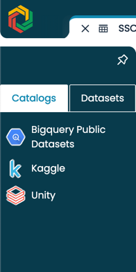
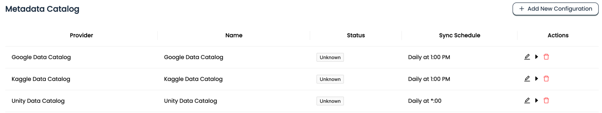

# Integrate with your Data Catalog

Bring your own data catalog to start monitoring assets.
DataOculus provides a user-friendly interface to configure, manage, and monitor all your data catalog assets at one place.

*DataOculus Metadata Catalog dashboard showing all configured catalog providers*

## Overview

The DataOculus catalog management interface provides:
- **Visual Configuration** - Configure catalog providers through an intuitive UI
- **Real-time Monitoring** - Track sync status and progress in real-time
- **Automated Scheduling** - Set up recurring sync schedules with cron expressions
- **Multi-Provider Support** - Connect to multiple catalog platforms simultaneously
- **Centralized Management** - Manage all catalog integrations from one place

## Getting Started

### Accessing the Catalog Management Interface

Navigate to **Settings > Metadata Catalog** in your DataOculus dashboard to access the catalog management interface.

*Main catalog management interface with existing configurations*

## Supported Catalog Providers

DataOculus supports integration with the following data catalog platforms:

### ✅ **Fully Supported**
- **Google Data Catalog** - Enterprise data discovery and metadata management for all your Google Cloud data assets
- **DataHub** - Open-source metadata platform from LinkedIn
- **OpenMetadata** - Open-source data discovery and collaboration platform
- **Kaggle Data Catalog** - Kaggle's public datasets
- **Unity Data Catalog** - Unified Data Catalog from Databricks

### 🚧 **Coming Soon**
- **Azure Data Catalog** - Microsoft's data discovery service
- **AWS Data Catalog** - Amazon's metadata management service

## ⚙️ Setting Up a New Catalog Integration

### Step 1: Start a New Configuration

To begin, click the **Add New Configuration** button located on your catalog interface.

*Screenshot: "Add New Configuration" button*

### Step 2: Select Your Catalog Provider

From the dropdown menu, select the catalog provider you wish to integrate. Each provider has unique settings you'll need to configure.

  
*Dropdown showing available catalog providers*

### Step 3: Enter Provider-Specific Settings

After selecting a provider, fill out the configuration form displayed. Settings vary depending on your chosen provider. For example:

#### 🔹 Google Data Catalog Configuration

[//]: # (![Google Data Catalog Config]&#40;./images/google-catalog-config.png&#41;)

Fill out the following required fields:

- **Project ID:** Identifier of your Google Cloud project.
- **Project Location:** The geographic location associated with your project.
- **Service Account Key:** Upload the JSON credentials for your service account. *(Credentials are securely stored.)*

#### DataHub

[//]: # (![DataHub Config]&#40;./images/datahub-config.png&#41;)
*DataHub configuration form*

**Required Fields:**
- **URL** - DataHub instance URL (e.g., `https://your-datahub.company.com`)

#### Unity Data Catalog (Databricks)

[//]: # (![Unity Catalog Config]&#40;./images/unity-catalog-config.png&#41;)
*Unity Data Catalog configuration form*

**Required Fields:**
- **Databricks Workspace URL** - Your Databricks workspace URL
- **Unity Catalog URL** - Auto-populated based on workspace URL
- **Personal Access Token** - Databricks PAT (stored securely as secret)

#### Kaggle Data Catalog

[//]: # (![Kaggle Config]&#40;./images/kaggle-config.png&#41;)
*Kaggle Data Catalog configuration form*

**Required Fields:**
- **Cookie** - Kaggle session cookie for authentication
- **X-XSRF Token** - CSRF protection token

### Step 4: Secure Secret Management

For sensitive fields like API keys and tokens, DataOculus provides secure secret storage:

[//]: # (![Secret Management]&#40;./images/secret-management.png&#41;)
*Secure secret input and storage interface*

1. Enter your secret value in the input field
2. Click **"Set Secret"** to securely store the credential
3. The secret is encrypted and stored safely
4. Only the secret path reference is saved in the configuration

## Managing Existing Configurations

### Configuration Overview Table

All configured catalog providers are displayed in an organized table with the following information:

*Table showing all configured catalog providers with status and actions*

**Columns:**
- **Provider** - The catalog platform (Google, DataHub, etc.)
- **Name** - Configuration display name
- **Status** - Real-time sync status with visual indicators
- **Sync Schedule** - Human-readable schedule description
- **Actions** - Edit, sync, and delete operations

### Real-Time Status Monitoring

DataOculus provides real-time status updates for all catalog sync operations:

[//]: # (![Status Indicators]&#40;./images/status-indicators.png&#41;)
*Different status indicators for catalog sync operations*

**Status Types:**
- 🔄 **Running** - Sync currently in progress (auto-refreshing)
- ✅ **Completed** - Sync finished successfully
- ✅ **Finished** - Sync completed without errors
- ❌ **Failed** - Sync encountered errors
- ❌ **Error** - System error during sync
- ❓ **Unknown** - Status unavailable

## Sync Scheduling

### Setting Up Automated Sync

Configure recurring sync schedules using the visual cron editor:

[//]: # (![Cron Scheduler]&#40;./images/cron-scheduler.png&#41;)
*Visual cron expression editor for scheduling automated syncs*

**Common Schedule Patterns:**
- **Daily at 1:00 PM** - `0 13 * * *`
- **Weekdays at 9:00 AM** - `0 9 * * 1-5`
- **Every 6 hours** - `0 */6 * * *`
- **Weekly on Sundays** - `0 2 * * 0`

### Manual Sync Operations

Start or stop sync operations manually using the action buttons:

*Manual sync control buttons for immediate operations*

**Available Actions:**
- ▶️ **Start Sync** - Begin immediate sync operation
- ⏸️ **Pause/Stop** - Stop currently running sync
- 🔄 **Auto-refresh** - Status updates every 30 seconds for running syncs

## Configuration Management

### Editing Configurations

Click the edit icon (✏️) to modify existing configurations:

*Edit configuration form with sync scheduling options*

**Editable Elements:**
- Connection parameters (URLs, credentials)
- Sync schedule settings
- Configuration name and description
- Advanced options and filters

### Deleting Configurations

Remove configurations you no longer need:

*Confirmation dialog for deleting catalog configurations*

**Safety Features:**
- Confirmation dialog prevents accidental deletion
- Configuration details shown for verification
- Permanent removal from all systems

### Common Issues & Solutions

*Common issues and their solutions in the interface*

**Connection Issues:**
- Verify network connectivity
- Check authentication credentials
- Validate URL endpoints
- Review firewall settings

**Sync Failures:**
- Check error logs for specific issues
- Verify permissions on source systems
- Monitor resource usage and limits
- Review data volume and timeout settings

## Next Steps

Once your catalog integrations are configured and running:

1. **[Explore Features](../features/index.md)** - Discover advanced search and discovery capabilities
2. **Set up Data Quality** - Implement automated quality monitoring
3. **Configure Governance** - Establish data governance policies
4. **Train Your Team** - Enable self-service data discovery

## Need Help?

*Available support resources and help documentation*

- **📖 Documentation** - Comprehensive guides and tutorials
- **💬 Community** - User forums and discussions
- **🎓 Training** - Interactive tutorials and webinars
- **🆘 Support** - Direct technical assistance

Contact our support team for assistance with catalog configuration and troubleshooting. 